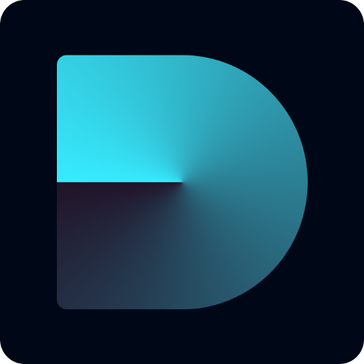

<h1 style="font-size: 60px;">Dropsome Hub</h1>

## Dropsome - A DeFi Project to Share SOL with Newbies

**Dropsome** is a decentralized finance (DeFi) app that allows users to share a small amount of SOL with someone who doesn't have a wallet. By generating a wallet and a secure link, the sender can easily drop SOL for a receiver to claim, without requiring them to have a wallet initially. The receiver can then claim the funds after installing a wallet app like Phantom or Solflare.

-   :material-share-variant:{ .lg .middle } __Drop__

    ---
    Sender sets SOL amount, generates a claim link, and shares it.

-   :material-hand-coin:{ .lg .middle } __Claim__

    ---

    Receiver opens the link, installs a wallet, connects, and claims SOL.

-   :material-backup-restore:{ .lg .middle } __Refund__

    ---

    Sender refunds unclaimed SOL by selecting the drop.

    

